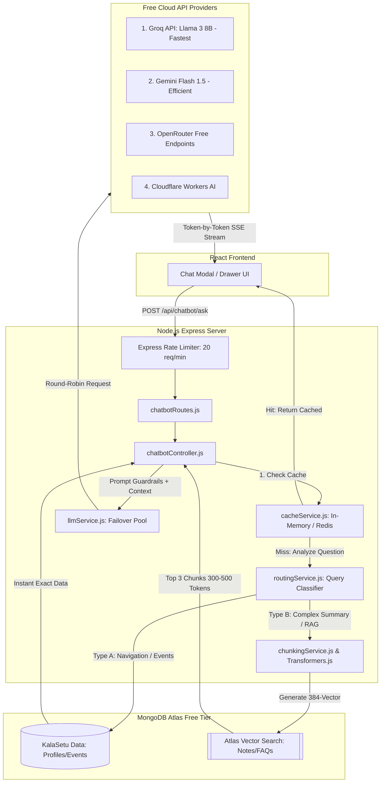

# KalaSetu Smart AI Orchestration Chatbot Implementation Plan (100% Free & Unlimited)

This updated implementation plan details the step-by-step process for integrating a highly robust **Smart AI Orchestration** chatbot into the KalaSetu MERN application. 

By separating deterministic retrieval from generative AI, implementing response caching, and prioritizing an intent-driven routing engine, this architecture guarantees near-zero latency, absolute free-tier quota preservation, and a premium streaming user experience.

---

## 1. System Architecture: Smart AI Orchestration



---

## 2. Phase Breakdown & Execution Steps

### Phase 1: Environment, Rate Limiting & Caching Setup
*Goal: Protect free-tier quotas from spammers and reuse generated answers instantly.*

1. **Dependency Installation:**
   ```bash
   npm install @xenova/transformers @google/generative-ai axios dotenv express-rate-limit
   ```
2. **Environment Variables (`backend/.env`):**
   ```env
   GROQ_API_KEY=your_groq_api_key_here
   GEMINI_API_KEY=your_gemini_api_key_here
   OPENROUTER_API_KEY=your_openrouter_api_key_here
   CLOUDFLARE_API_KEY=your_cloudflare_api_key_here
   ```
3. **Configure Rate Limiter (`backend/middlewares/chatRateLimiter.js`):**
   * Use `express-rate-limit` to restrict users to a maximum of 20 requests per minute per IP address.
4. **Implement Cache Service (`backend/services/cacheService.js`):**
   * Create an in-memory storage map or Redis wrapper storing `{ [questionHash]: { answer, timestamp } }`.
   * Cache successful AI and DB answers for 24 hours to prevent redundant API calls on common questions (e.g., `"When are exams?"`).

---

### Phase 2: Intent Router & Query Classification (`routingService.js`)
*Goal: Stop wasting LLM tokens and vector search latency on simple questions.*

1. **Create Intent Routing Engine (`backend/services/routingService.js`):**
   * Build a lightweight classifier (using regex matching or local `nlp.js` intent recognition) that inspects incoming queries before any RAG action.
   * **Classification Matrix:**
     * `Navigation` (e.g., `"Where is edit profile?"`): Bypass LLM. Return direct navigation map -> `"/profile/settings"`.
     * `Event / Attendance Lookup` (e.g., `"When is the hackathon?"`): Bypass LLM. Perform direct MongoDB `events.findOne()`.
     * `Complex RAG / Summaries` (e.g., `"Summarize the AI exam syllabus notes"`): Route to Vector Search & LLM Pool.

---

### Phase 3: Smart Chunking & Selective Ingestion (`chunkingService.js`)
*Goal: Ensure high-quality semantic retrieval by embedding only dense content in 300–500 token chunks.*

1. **Selective Ingestion Policy:**
   * **Do Embed:** Academic Notes, Announcements, FAQs, Event descriptions, Platform Policies.
   * **Do NOT Embed:** Short usernames, 1-sentence profile bios, random timestamps, or UI button labels.
2. **Create Chunking Service (`backend/services/chunkingService.js`):**
   * When academic notes or long policies are saved in KalaSetu, split the document into clean paragraphs or sections of roughly 300–500 tokens before passing them to `Transformers.js`.
3. **Store in MongoDB Atlas:**
   * Save each chunk as a separate document in the `knowledgebase` collection with its calculated 384-float vector.

---

### Phase 4: Prompt Guardrails & Hallucination Prevention
*Goal: Strictly restrict open-source LLMs from inventing fake rules or answers outside KalaSetu data.*

1. **Construct the Anti-Hallucination Prompt (`backend/utils/promptBuilder.js`):**
   Whenever a query is classified for RAG, format the prompt exactly as follows:
   ```javascript
   const buildPrompt = (contextChunks, userQuestion) => `
   You are KalaSetu AI Assistant.
   Answer ONLY using the provided context below.

   If the answer is not present in the context, say exactly:
   "I couldn't find that information in KalaSetu."

   Context:
   ${contextChunks.join("\n\n")}

   Question:
   ${userQuestion}
   `;
   ```

---

### Phase 5: LLM Pool Orchestration & Server-Sent Events (SSE) Streaming
*Goal: Deliver perceived instant speed through token streaming and guarantee 100% uptime with graceful fallbacks.*

1. **Create LLM Failover Pool (`backend/services/llmService.js`):**
   * Order of execution priority:
     1. **Groq API** (Llama 3 8B) -> *Fastest speed (500+ tokens/sec).*
     2. **Gemini Flash 1.5** -> *Highly efficient backup.*
     3. **OpenRouter Free Endpoints** -> *Diverse backup models.*
     4. **Cloudflare Workers AI** -> *Edge network reliability.*
   * **Graceful Fallback Handler:** If all 4 cloud providers experience outages or quota exhaustion simultaneously, catch the error and return:
     `"AI assistant is busy right now. Please try again shortly."` (Avoids 500 server crashes).

2. **Implement SSE Token Streaming (`backend/controllers/chatbotController.js`):**
   * Use Express HTTP Server-Sent Events (`res.setHeader('Content-Type', 'text/event-stream')`).
   * Stream incoming tokens from Groq/Gemini directly to the client as they are generated, rather than waiting 3 seconds for the complete paragraph.

---

### Phase 6: Frontend UX with Streaming Support
*Goal: Display real-time streaming output in the React application.*

1. **Update Chat Drawer (`frontend/src/components/chatbot/ChatDrawer.jsx`):**
   * When a user sends a message, open an `EventSource` or use `fetch` with `ReadableStream` to receive incoming chunks.
   * Append tokens in real-time to the active message bubble.
   * Automatically scroll to the bottom of the chat view as new tokens arrive.

---

## 3. Verification & Architecture Checklist

* [ ] **Rate Limiting:** Verify that sending 21 requests within a minute successfully returns HTTP 429 Too Many Requests.
* [ ] **Cache Hit Verification:** Verify that asking `"Where is my profile?"` twice returns the second answer instantly in <5ms without triggering console logs in `llmService.js`.
* [ ] **Intent Bypass:** Confirm that navigation queries return direct route JSON without querying MongoDB Vector Search.
* [ ] **Hallucination Test:** Ask the bot `"Who won the 2026 World Cup?"` and verify it replies exactly `"I couldn't find that information in KalaSetu."`
* [ ] **Streaming Validation:** Inspect the browser Network Tab to confirm the response arrives as an SSE stream with progressive text rendering.
